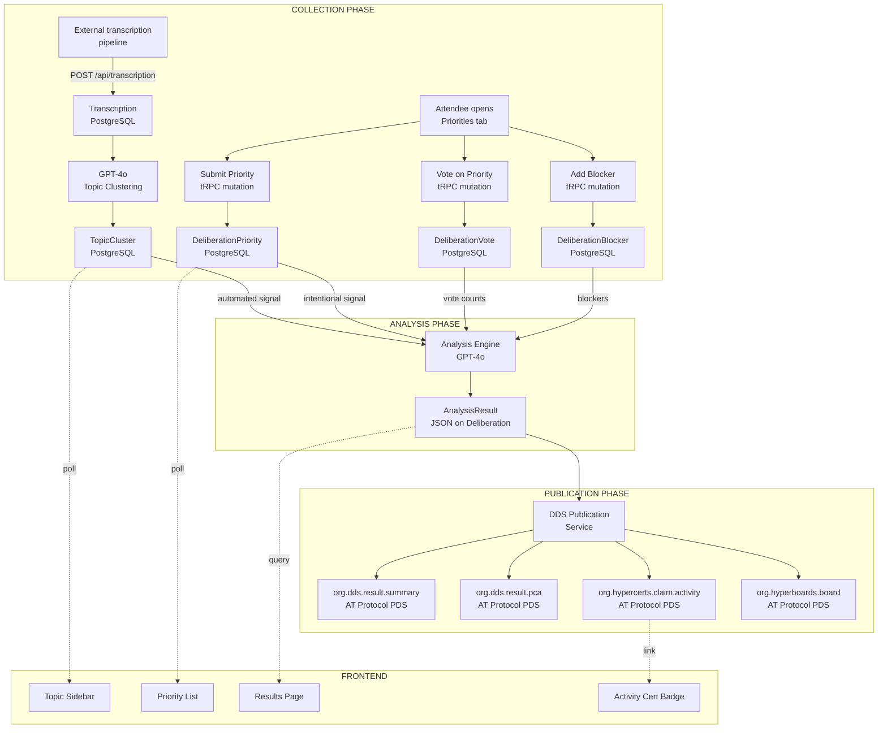
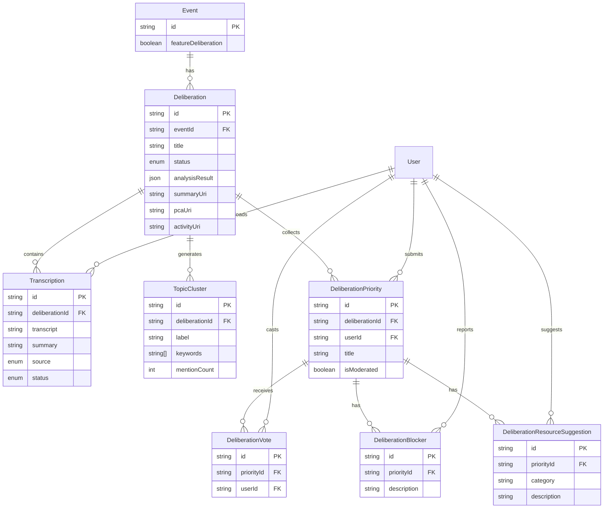
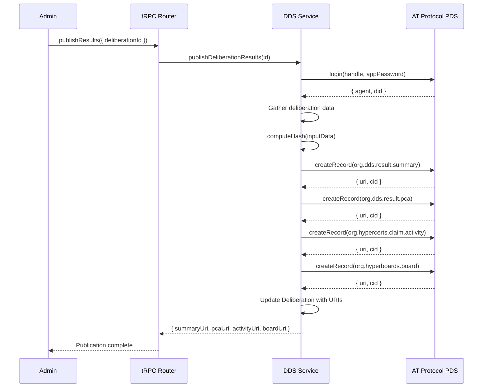
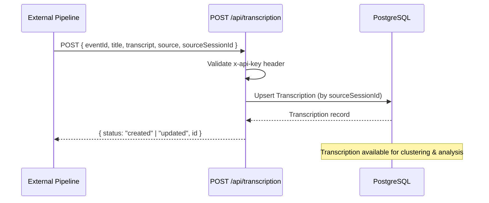

> **Note**: See GitHub issue #26 for current issue breakdown.
> Local specs retained for offline reference but GitHub issues are the source of truth.
> Architecture: **Single repo** (`impactful-events`) for all features (clustering, analysis, DDS publication, UI).
> **Transcriptions are ingested as text only** via external pipeline and inserted through the REST API (`/api/transcription`). No audio upload or Whisper processing in this repo.

# Conference Intelligence System -- Technical Specification

## Overview

This document provides the complete technical specification for implementing the Conference Intelligence / DDS Deliberation system within the existing FtC Platform (impactful-events). It is designed for Claude Code to use as an implementation reference.

**Parent issue**: #26
**Sub-issues**: #27, #28, #29, #30, #31

---

## System Architecture Diagrams

### Full Pipeline



### Service Layer Architecture

```
┌──────────────────────────────────────────────────────────────────┐
│                        NEXT.JS APP                               │
│                                                                  │
│  ┌────────────────────────────────────────────────────────────┐  │
│  │  FRONTEND (React + Mantine)                                │  │
│  │                                                            │  │
│  │  /events/[eventId]/deliberation/                           │  │
│  │    DeliberationClient ──→ PriorityCard ──→ VoteButton      │  │
│  │    PrioritySubmitForm     TopicClustersSidebar             │  │
│  │                                                            │  │
│  │  /events/[eventId]/deliberation/results/                   │  │
│  │    ResultsClient ──→ SignalBadges + BlockerThemes          │  │
│  └────────────────────────┬───────────────────────────────────┘  │
│                           │ tRPC                                 │
│  ┌────────────────────────▼───────────────────────────────────┐  │
│  │  API LAYER                                                 │  │
│  │                                                            │  │
│  │  deliberation.ts (tRPC router)                             │  │
│  │    ├── getDeliberation        ← publicProcedure            │  │
│  │    ├── getPriorities          ← protectedProcedure         │  │
│  │    ├── getTopicClusters       ← protectedProcedure         │  │
│  │    ├── submitPriority         ← protectedProcedure         │  │
│  │    ├── vote                   ← protectedProcedure         │  │
│  │    ├── submitBlocker          ← protectedProcedure         │  │
│  │    ├── triggerClustering      ← adminProcedure             │  │
│  │    ├── triggerAnalysis        ← adminProcedure             │  │
│  │    └── publishResults         ← adminProcedure             │  │
│  │                                                            │  │
│  │  deliberationAuth.ts (auth helpers)                        │  │
│  │    ├── isAcceptedAttendee()                                │  │
│  │    ├── isDeliberationAdmin()                               │  │
│  │    └── assertDeliberationAccess()                          │  │
│  │                                                            │  │
│  │  /api/transcription/route.ts (Next.js API route)            │  │
│  │    └── POST → Ingest transcription text via API key auth   │  │
│  └────────────────────────┬───────────────────────────────────┘  │
│                           │                                      │
│  ┌────────────────────────▼───────────────────────────────────┐  │
│  │  SERVICE LAYER                                             │  │
│  │                                                            │  │
│  │  (transcriptions ingested via REST API — no service needed) │  │
│  │                                                            │  │
│  │  topicClustering.ts                                        │  │
│  │    └── extractTopics() → GPT-4o structured output          │  │
│  │                                                            │  │
│  │  deliberationAnalysis.ts                                   │  │
│  │    └── analyze() → GPT-4o merge + classify + synthesize    │  │
│  │                                                            │  │
│  │  dds.ts                                                    │  │
│  │    ├── createDDSSummaryRecord() → AT Protocol PDS          │  │
│  │    ├── createDDSPcaRecord()     → AT Protocol PDS          │  │
│  │    ├── createActivityRecord()   → AT Protocol PDS          │  │
│  │    └── createBoardRecord()      → AT Protocol PDS          │  │
│  └────────────────────────┬───────────────────────────────────┘  │
│                           │                                      │
│  ┌────────────────────────▼───────────────────────────────────┐  │
│  │  DATA LAYER                                                │  │
│  │                                                            │  │
│  │  PostgreSQL (Prisma ORM)          External Services        │  │
│  │  ├── Deliberation                 ├── OpenAI API           │  │
│  │  ├── Transcription                │   └── GPT-4o           │  │
│  │  ├── TopicCluster                 ├── AT Protocol PDS      │  │
│  │  ├── DeliberationPriority         └── (transcriptions      │  │
│  │  ├── DeliberationVote                  ingested externally) │  │
│  │  ├── DeliberationBlocker                                   │  │
│  │  └── DeliberationResourceSuggestion                        │  │
│  └────────────────────────────────────────────────────────────┘  │
└──────────────────────────────────────────────────────────────────┘
```

### Database Entity Relationships



### ATProto Record Creation Flow



---

## Reference Repository Analysis

### hypgen (`../hypgen`)

**Architecture**: Full-stack TypeScript monorepo (pnpm) with client (React 19 SPA), server (Express 5 + Drizzle ORM + SQLite), shared (Zod schemas + generated lexicon types).

**Reusable patterns**:
- Lexicon JSON definitions at `lexicons/` -- three custom types: `ai.hypgen.hypothesis`, `ai.hypgen.reaction`, `ai.hypgen.subgraph`
- Record creation via `com.atproto.repo.createRecord` with typed collection names
- `@atproto/api` `AtpAgent` for PDS authentication (login with handle + app password)
- Database-first architecture: index records locally in SQLite, no full federation
- Service layer pattern: `ReactionService`, `FeedService`, `CommentService`, `ProfileService`
- JWT auth middleware (extract bearer token, decode to get DID)
- `BidirectionalResolver` for DID/handle resolution

**Ignore**:
- Full firehose ingestion via `@atproto/sync` (overkill for POC)
- OpenAI Instructor sync pipeline (domain-specific for hypothesis compression)
- Drizzle ORM + SQLite (we use Prisma + PostgreSQL)
- Complex profile caching
- Cron job for periodic sync

**Key dependencies**: `@atproto/api@^0.15.25`, `@atproto/sync@^0.1.29`, `@atproto/identity@^0.4.8`, `@instructor-ai/instructor@^1.7.0`, `openai@^5.9.0`, `zod@^3.24.4`

### father-governance (`../father-governance`)

**Architecture**: Monorepo with frontend (React 18 + Vite), api (Express/Hono + Cloudflare Workers), leaderboard (React SPA with react-router-dom).

**Reusable patterns**:
- LLM-based extraction from transcripts (`sin-extraction.ts` -> our `topicClustering.ts`)
  - Build prompt with predefined categories
  - Send to LLM (OpenAI/Anthropic)
  - Parse JSON response
  - Validate and normalize output
  - Return typed array
- Leaderboard UI: rank cards with progress bars, severity badges, auto-refresh (5min interval)
- Whisper transcription via Tinfoil service (reference only — we ingest text externally)
- Backend: route -> service -> record creation pattern
- VAD (Voice Activity Detection) settings for chunked recording

**Ignore**:
- Automerge CRDT backend (replaced by PostgreSQL)
- Lexicon Proxy external service
- Neo-brutalist styling (we use Mantine)
- Confessional conversation flow
- Voice Activity Detection (not applicable)

**Key dependencies**: `@anthropic-ai/sdk@^0.32.1`, `hono@^4.10.5`, `openai@^4.75.0`, `tinfoil@^0.10.9`, `zod@^3.23.8`

### DDS Specification (`../dds`)

**Core concepts**:
- Three-phase lifecycle: Plan -> Collect -> Analyze
- Lexicons: `org.dds.module.polis` (opinions + votes), `org.dds.result.pca` (clustering), `org.dds.result.summary` (LLM summaries)
- Result commitment: `{ inputHash, algorithm, outputHash, analyzerDid }`
- Transport: AT Protocol (Firehose for real-time, AppViews for indexing)
- Identity levels: 0 (identified) -> 3 (anonymous, ZK-verified)
- Verification levels: Reputation -> Spot Check -> Trustless (zkML)

**For POC we implement**: `org.dds.result.summary`, `org.dds.result.pca` record creation only. No firehose, no zkML, no Ethereum commitment.

### ATProto Breaking Changes (hypgen -> current)

- `@atproto/api`: hypgen uses `^0.15.25`, our codebase has `^0.17.4`. The core APIs (`AtpAgent.login()`, `com.atproto.repo.createRecord()`) are stable. Our existing `activityCerts.ts` already uses the same patterns successfully with `^0.17.4`.
- `@atproto/sync`: Not needed for POC (no firehose subscription).
- `@atproto/lex-cli`: Not needed for POC (no code generation; use `Record<string, unknown>` for records, matching `activityCerts.ts` pattern).

---

## Database Schema Additions

### Event model addition

```prisma
// Add to existing Event model:
featureDeliberation     Boolean @default(false)
deliberations           Deliberation[]
```

### New enums

```prisma
enum DeliberationStatus {
  COLLECTING
  CLOSED
  ANALYZING
  PUBLISHED
}

enum TranscriptStatus {
  PENDING
  PROCESSING
  COMPLETED
  FAILED
}

enum TranscriptionSource {
  MANUAL
  WHISPER_API
  BROWSER
  WEBHOOK
  API
}
```

### New models

```prisma
model Deliberation {
  id            String              @id @default(cuid())
  eventId       String
  title         String
  description   String?             @db.Text
  status        DeliberationStatus  @default(COLLECTING)
  closesAt      DateTime?
  createdAt     DateTime            @default(now())
  updatedAt     DateTime            @updatedAt

  // DDS publication references (set after publish)
  summaryUri    String?
  summaryCid    String?
  pcaUri        String?
  pcaCid        String?
  activityUri   String?
  activityCid   String?
  boardUri      String?
  boardCid      String?

  // Analysis result (stored as JSON for POC flexibility)
  analysisResult Json?

  event         Event               @relation(fields: [eventId], references: [id], onDelete: Cascade)
  transcripts   FloorTranscript[]
  topicClusters TopicCluster[]
  priorities    DeliberationPriority[]

  @@unique([eventId, title])
  @@index([eventId])
  @@index([status])
}

model Transcription {
  id                String              @id @default(cuid())
  eventId           String
  deliberationId    String?
  sessionId         String?             // Optional link to ScheduleSession
  venueId           String?             // Optional link to ScheduleVenue
  title             String              // e.g. "Floor 3 - Morning Session"
  transcript        String?             @db.Text
  summary           String?             @db.Text
  notes             String?             @db.Text
  source            TranscriptionSource @default(API)
  sourceSessionId   String?             @unique // External dedup key
  status            TranscriptStatus    @default(COMPLETED)
  errorMessage      String?
  uploadedById      String?
  createdAt         DateTime            @default(now())
  updatedAt         DateTime            @updatedAt

  event             Event               @relation(fields: [eventId], references: [id], onDelete: Cascade)
  deliberation      Deliberation?       @relation(fields: [deliberationId], references: [id], onDelete: Cascade)
  uploadedBy        User?               @relation("TranscriptUploads", fields: [uploadedById], references: [id])

  @@index([eventId])
  @@index([deliberationId])
  @@index([status])
}

model TopicCluster {
  id              String       @id @default(cuid())
  deliberationId  String
  label           String       // e.g. "Public goods funding models"
  keywords        String[]
  mentionCount    Int          @default(0)
  sourceExcerpts  String[]
  createdAt       DateTime     @default(now())
  updatedAt       DateTime     @updatedAt

  deliberation    Deliberation @relation(fields: [deliberationId], references: [id], onDelete: Cascade)

  @@index([deliberationId])
  @@index([mentionCount])
}

model DeliberationPriority {
  id              String       @id @default(cuid())
  deliberationId  String
  userId          String
  title           String
  description     String?      @db.Text
  trackId         String?      // Optional link to ScheduleTrack
  isModerated     Boolean      @default(false)
  createdAt       DateTime     @default(now())
  updatedAt       DateTime     @updatedAt

  deliberation    Deliberation            @relation(fields: [deliberationId], references: [id], onDelete: Cascade)
  user            User                    @relation("UserPriorities", fields: [userId], references: [id])
  votes           DeliberationVote[]
  blockers        DeliberationBlocker[]
  resources       DeliberationResourceSuggestion[]

  @@index([deliberationId])
  @@index([userId])
}

model DeliberationVote {
  id          String               @id @default(cuid())
  priorityId  String
  userId      String
  createdAt   DateTime             @default(now())

  priority    DeliberationPriority @relation(fields: [priorityId], references: [id], onDelete: Cascade)
  user        User                 @relation("UserDeliberationVotes", fields: [userId], references: [id])

  @@unique([priorityId, userId])
  @@index([priorityId])
  @@index([userId])
}

model DeliberationBlocker {
  id          String               @id @default(cuid())
  priorityId  String
  userId      String
  description String               @db.Text
  createdAt   DateTime             @default(now())

  priority    DeliberationPriority @relation(fields: [priorityId], references: [id], onDelete: Cascade)
  user        User                 @relation("UserDeliberationBlockers", fields: [userId], references: [id])

  @@index([priorityId])
  @@index([userId])
}

model DeliberationResourceSuggestion {
  id          String               @id @default(cuid())
  priorityId  String
  userId      String
  category    String               // "funding" | "talent" | "tooling" | "other"
  description String               @db.Text
  createdAt   DateTime             @default(now())

  priority    DeliberationPriority @relation(fields: [priorityId], references: [id], onDelete: Cascade)
  user        User                 @relation("UserDeliberationResources", fields: [userId], references: [id])

  @@index([priorityId])
  @@index([userId])
}
```

### User model additions

```prisma
// Add to existing User model:
transcriptUploads        Transcription[]                @relation("TranscriptUploads")
deliberationPriorities   DeliberationPriority[]         @relation("UserPriorities")
deliberationVotes        DeliberationVote[]             @relation("UserDeliberationVotes")
deliberationBlockers     DeliberationBlocker[]          @relation("UserDeliberationBlockers")
deliberationResources    DeliberationResourceSuggestion[] @relation("UserDeliberationResources")
```

---

## tRPC Router Design

**File**: `src/server/api/routers/deliberation.ts`
**Register in**: `src/server/api/root.ts` as `deliberation: deliberationRouter`

### Queries

#### `getDeliberation`
```typescript
Input:  z.object({ eventId: z.string() })
Output: Deliberation with { priorityCount, totalVotes, transcriptCount, topicClusterCount }
Auth:   Public for PUBLISHED status, accepted attendee otherwise
```

#### `getPriorities`
```typescript
Input:  z.object({
  deliberationId: z.string(),
  sortBy: z.enum(["votes", "recent"]).optional().default("votes"),
  trackId: z.string().optional(),
})
Output: Array<{
  id, title, description, trackId, createdAt,
  user: { id, name, image },
  _count: { votes, blockers, resources },
  hasVoted: boolean,  // Current user's vote status
  blockers: Array<{ id, description, user: { name } }>,
  resources: Array<{ id, category, description, user: { name } }>,
}>
Auth:   Accepted attendee
```

#### `getTopicClusters`
```typescript
Input:  z.object({ deliberationId: z.string() })
Output: Array<{ id, label, keywords, mentionCount, sourceExcerpts }>
Auth:   Accepted attendee
```

#### `getTranscripts`
```typescript
Input:  z.object({ deliberationId: z.string() })
Output: Array<{ id, title, status, transcript, summary, source, errorMessage, uploadedBy: { name }, createdAt }>
Auth:   Admin/staff or floor lead
```

#### `getAnalysisResults`
```typescript
Input:  z.object({ deliberationId: z.string() })
Output: {
  analysisResult: JSON (AnalysisResult shape),
  summaryUri, pcaUri, activityUri, boardUri
}
Auth:   Public (after PUBLISHED status)
```

### Mutations

#### `createDeliberation`
```typescript
Input:  z.object({ eventId: z.string(), title: z.string(), description: z.string().optional(), closesAt: z.date().optional() })
Output: Deliberation
Auth:   Admin/staff
```

#### `submitPriority`
```typescript
Input:  z.object({ deliberationId: z.string(), title: z.string().min(3).max(200), description: z.string().max(2000).optional(), trackId: z.string().optional() })
Output: DeliberationPriority
Auth:   Accepted attendee
Validation: Deliberation must be in COLLECTING status
```

#### `vote`
```typescript
Input:  z.object({ priorityId: z.string() })
Output: { voted: boolean, voteCount: number }
Auth:   Accepted attendee
Behavior: Toggle -- if already voted, remove vote; if not, add vote
```

#### `submitBlocker`
```typescript
Input:  z.object({ priorityId: z.string(), description: z.string().min(3).max(2000) })
Output: DeliberationBlocker
Auth:   Accepted attendee
```

#### `submitResourceSuggestion`
```typescript
Input:  z.object({ priorityId: z.string(), category: z.enum(["funding", "talent", "tooling", "other"]), description: z.string().min(3).max(2000) })
Output: DeliberationResourceSuggestion
Auth:   Accepted attendee
```

#### Transcription Ingestion (REST API, not tRPC)

Transcriptions are ingested via `POST /api/transcription` with API key auth (`TRANSCRIPTION_API_KEY`).
See "Transcription REST API" section below. No audio upload or processing needed.

#### `triggerClustering`
```typescript
Input:  z.object({ deliberationId: z.string() })
Output: { clusterCount: number }
Auth:   Admin/staff
```

#### `triggerAnalysis`
```typescript
Input:  z.object({ deliberationId: z.string() })
Output: { status: "analyzing" }
Auth:   Admin/staff
```

#### `publishResults`
```typescript
Input:  z.object({ deliberationId: z.string() })
Output: { summaryUri, summaryCid, pcaUri, pcaCid, activityUri, activityCid, boardUri, boardCid, contributorCount }
Auth:   Admin/staff
```

#### `closeDeliberation`
```typescript
Input:  z.object({ deliberationId: z.string() })
Output: Deliberation (status: CLOSED)
Auth:   Admin/staff
```

#### `moderatePriority`
```typescript
Input:  z.object({ priorityId: z.string(), isModerated: z.boolean() })
Output: DeliberationPriority
Auth:   Admin/staff
```

---

## Auth Helpers

**File**: `src/server/api/utils/deliberationAuth.ts`

Follow `src/server/api/utils/scheduleAuth.ts` patterns.

```typescript
// Check if user has an accepted application for the event's deliberation
export async function isAcceptedAttendee(
  db: PrismaClient, userId: string, eventId: string
): Promise<boolean>

// Check admin/staff or event creator
export async function isDeliberationAdmin(
  db: PrismaClient, userId: string, eventId: string
): Promise<boolean>

// Throw FORBIDDEN if not accepted attendee
export async function assertDeliberationAccess(
  db: PrismaClient, userId: string, eventId: string
): Promise<void>

// Throw FORBIDDEN if not admin
export async function assertDeliberationAdmin(
  db: PrismaClient, userId: string, eventId: string
): Promise<void>
```

---

## Service Layer

### Transcription Ingestion (REST API)

**No transcription service needed in this repo.** Transcriptions are produced externally and ingested via the REST API at `src/app/api/transcription/route.ts`.

The API accepts `POST` requests with API key auth (`x-api-key` header validated against `TRANSCRIPTION_API_KEY` env var). It supports:
- Creating new transcriptions with `title`, `transcript`, `summary`, `notes`, `source`, `sourceSessionId`
- Upserting by `sourceSessionId` for idempotent ingestion
- Linking to events and optionally to deliberations

**Already implemented** — see `src/app/api/transcription/route.ts` and `src/utils/validateApiKey.ts`.

### `src/server/services/topicClustering.ts`

**Pattern reference**: `src/server/services/aiEvaluation.ts` (structured GPT-4o output)

```typescript
interface ExtractedTopic {
  label: string;
  keywords: string[];
  mentionCount: number;
  sourceExcerpts: string[];
}

export class TopicClusteringService {
  private openai: OpenAI;

  async extractTopics(deliberationId: string, db: PrismaClient): Promise<ExtractedTopic[]> {
    // 1. Fetch all COMPLETED Transcription records
    // 2. Concatenate transcripts with floor/session labels
    // 3. GPT-4o structured output prompt:
    //    System: "You are analyzing conference transcripts. Extract major topics."
    //    User: "From these transcripts, extract topics. For each: label (concise name),
    //           keywords (3-7), estimated mention count, 2-3 representative quotes.
    //           Return as JSON array."
    // 4. Parse JSON response
    // 5. Delete existing TopicCluster records for this deliberation
    // 6. Create new TopicCluster records
    // 7. Return extracted topics
  }
}
```

**GPT-4o prompt structure** (following father-governance sin-extraction pattern):
```
System: You are a conference intelligence analyst. Extract the major topics and themes
discussed across these conference transcripts. Focus on substantive topics related to
priorities, problems, solutions, opportunities, and resource needs.

User: Analyze the following conference transcripts and extract topics.

For each topic provide:
- label: A concise descriptive name (3-8 words)
- keywords: 3-7 related terms or phrases
- mentionCount: Estimated number of times this topic was discussed
- sourceExcerpts: 2-3 representative quotes from the transcripts

Return as a JSON array of objects. Extract 5-20 topics depending on content richness.

Transcripts:
---
[Floor: {title}]
{transcript text}
---
```

### `src/server/services/deliberationAnalysis.ts`

**Pattern reference**: `src/server/services/aiEvaluation.ts`

```typescript
interface PrioritySignal {
  priorityId: string;
  title: string;
  voteCount: number;
  blockerCount: number;
  classification: "convergent" | "blind_spot" | "aspirational";
  signalStrength: number; // 0-100
  matchedTopics: string[];
}

interface AnalysisResult {
  rankedPriorities: PrioritySignal[];
  blindSpots: Array<{ topicLabel: string; keywords: string[]; mentionCount: number }>;
  blockerThemes: Array<{ theme: string; blockers: string[]; count: number }>;
  resourceRecommendations: Array<{ category: string; description: string; priority: string }>;
  synthesis: string;
  metadata: {
    totalPriorities: number;
    totalVotes: number;
    totalTranscripts: number;
    totalTopics: number;
    analyzedAt: string;
  };
}

export class DeliberationAnalysisService {
  private openai: OpenAI;

  async analyze(deliberationId: string, db: PrismaClient): Promise<AnalysisResult> {
    // 1. Fetch topic clusters (automated signal)
    // 2. Fetch priorities with vote counts, blockers, resources (intentional signal)
    // 3. Send both to GPT-4o for correlation and classification:
    //    - "convergent": high votes AND matched to prominent topic
    //    - "blind_spot": prominent topic but no matching priority submitted
    //    - "aspirational": high votes but not in transcripts
    // 4. Generate synthesis answering three questions
    // 5. Group blockers by theme
    // 6. Compile resource recommendations
    // 7. Store analysisResult JSON on Deliberation
    // 8. Update status to PUBLISHED
    // 9. Return structured result
  }
}
```

**GPT-4o analysis prompt**:
```
System: You are a conference intelligence analyst merging two data sources to produce
actionable community insights.

User: Merge these two signal sources and produce a structured analysis.

AUTOMATED SIGNAL (topic clusters from transcripts):
{JSON array of topic clusters}

INTENTIONAL SIGNAL (attendee-submitted priorities with votes):
{JSON array of priorities with vote counts and blockers}

Classify each priority as:
- "convergent": Highly voted AND matches a prominent transcript topic
- "aspirational": Highly voted but NOT discussed in transcripts
Identify "blind_spots": Topics heavily discussed but NOT submitted as priorities.

Produce a JSON response with:
1. rankedPriorities: priorities sorted by combined signal strength (0-100)
2. blindSpots: discussed topics with no matching priority
3. blockerThemes: group all blockers by theme
4. resourceRecommendations: synthesize resource suggestions by category
5. synthesis: 2-3 paragraph narrative answering:
   - What matters most to this community?
   - What are the key blockers?
   - Where should resources go?
```

### `src/server/services/dds.ts`

**Pattern reference**: `src/server/services/activityCerts.ts` (exact same ATProto pattern)

```typescript
import { AtpAgent } from "@atproto/api";
import { type PrismaClient } from "@prisma/client";
import { TRPCError } from "@trpc/server";
import { env } from "~/env.js";
import * as Sentry from "@sentry/nextjs";
import { createHash } from "crypto";

interface CreateRecordResponse {
  uri: string;
  cid: string;
}

export class DDSPublicationService {
  private db: PrismaClient;
  private pdsUrl: string;

  constructor(db: PrismaClient) {
    this.db = db;
    this.pdsUrl = env.ATPROTO_PDS_URL ?? "https://bsky.social";
  }

  // Identical to ActivityCertService.getPlatformAgent()
  private async getPlatformAgent(): Promise<{ agent: AtpAgent; did: string }> { ... }

  // SHA-256 hash for DDS verification
  private computeHash(data: string): string {
    return createHash("sha256").update(data).digest("hex");
  }

  private async createDDSSummaryRecord(
    agent: AtpAgent, did: string, deliberation: DeliberationWithRelations
  ): Promise<CreateRecordResponse> {
    const record: Record<string, unknown> = {
      $type: "org.dds.result.summary",
      deliberationTitle: deliberation.title,
      eventName: deliberation.event.name,
      createdAt: new Date().toISOString(),
      inputHash: this.computeHash(JSON.stringify({
        priorities: deliberation.priorities,
        topicClusters: deliberation.topicClusters,
      })),
      algorithm: "gpt4o-merge-v1",
      ...deliberation.analysisResult,
    };

    const response = (await agent.com.atproto.repo.createRecord({
      repo: did,
      collection: "org.dds.result.summary",
      record,
    })) as unknown as { data: CreateRecordResponse };

    return response.data;
  }

  private async createDDSPcaRecord(
    agent: AtpAgent, did: string, deliberation: DeliberationWithRelations
  ): Promise<CreateRecordResponse> {
    const record: Record<string, unknown> = {
      $type: "org.dds.result.pca",
      deliberationTitle: deliberation.title,
      createdAt: new Date().toISOString(),
      inputHash: this.computeHash(
        deliberation.transcripts.map(t => t.transcript).join("\n")
      ),
      algorithm: "gpt4o-topic-extraction-v1",
      clusters: deliberation.topicClusters.map(tc => ({
        label: tc.label,
        keywords: tc.keywords,
        mentionCount: tc.mentionCount,
        sourceExcerpts: tc.sourceExcerpts,
      })),
    };

    const response = (await agent.com.atproto.repo.createRecord({
      repo: did,
      collection: "org.dds.result.pca",
      record,
    })) as unknown as { data: CreateRecordResponse };

    return response.data;
  }

  // Reuse ActivityCertService patterns for activity cert + board
  private async createActivityRecord(...): Promise<CreateRecordResponse> { ... }
  private async createBoardRecord(...): Promise<CreateRecordResponse> { ... }

  async publishDeliberationResults(deliberationId: string): Promise<PublishResult> {
    // 1. getPlatformAgent()
    // 2. Fetch deliberation with all relations
    // 3. Create org.dds.result.summary
    // 4. Create org.dds.result.pca
    // 5. Create org.hypercerts.claim.activity (all participants as contributors)
    // 6. Create org.hyperboards.board
    // 7. Update Deliberation with all URIs/CIDs
    // 8. Return all URIs
  }
}
```

---

## Transcription Ingestion Flow



## Transcription REST API

**File**: `src/app/api/transcription/route.ts` (already implemented)

```typescript
// POST — ingest transcription text from external pipeline
// Auth: x-api-key header validated against TRANSCRIPTION_API_KEY env var
// Supports upsert by sourceSessionId for idempotent ingestion
// Links to event (required) and deliberation (optional)
```

---

## Frontend Pages

### Route structure

```
src/app/events/[eventId]/deliberation/
  page.tsx                       -- Server component with Suspense wrapper
  DeliberationClient.tsx         -- Main client component
  PriorityCard.tsx               -- Priority card with vote, blocker, resource UI
  PrioritySubmitForm.tsx         -- Modal/form to submit new priority
  TopicClustersSidebar.tsx       -- Sidebar showing topic clusters from transcripts
  results/
    page.tsx                     -- Server component
    ResultsClient.tsx            -- Results display

Admin pages (embedded in existing admin event detail):
  Deliberation management section with:
    - Create deliberation form
    - Transcription list (ingested via API)
    - Trigger clustering / analysis / publish buttons
```

### Component hierarchy

```
DeliberationClient.tsx
  ├── PrioritySubmitForm (modal)
  │     └── Form: title, description, track select
  │     └── Mutation: submitPriority
  ├── Priority list (sorted by votes or recent)
  │     └── PriorityCard (repeated)
  │           ├── Vote button (toggle, optimistic update)
  │           ├── Blocker section (expandable)
  │           │     ├── Blocker list
  │           │     └── Add blocker form
  │           └── Resource section (expandable)
  │                 ├── Resource suggestion list
  │                 └── Add resource form
  └── TopicClustersSidebar
        └── Topic cards with labels, keywords, mention counts

ResultsClient.tsx
  ├── Signal legend (convergent / blind_spot / aspirational)
  ├── Ranked priorities with signal badges and strength bars
  ├── Blocker themes (grouped cards)
  ├── Resource recommendations
  ├── Synthesis narrative
  └── AT Proto record links (summaryUri, pcaUri, activityUri)
```

### Event integration

Add "Priorities" tab to `src/app/events/[eventId]/EventDetailClient.tsx`, gated by `event.featureDeliberation`:

```typescript
// In the tabs array, add:
{
  value: "priorities",
  label: "Priorities",
  icon: <IconTarget size={16} />,
  visible: event.featureDeliberation,
}
```

Route to `/events/[eventId]/deliberation` when tab is clicked.

### Data fetching pattern

```typescript
// Use tRPC React Query hooks with appropriate polling
const { data: deliberation } = api.deliberation.getDeliberation.useQuery(
  { eventId },
  { enabled: !!eventId }
);

const { data: priorities } = api.deliberation.getPriorities.useQuery(
  { deliberationId: deliberation?.id ?? "", sortBy },
  { enabled: !!deliberation?.id, refetchInterval: 30000 } // Poll every 30s
);

const voteMutation = api.deliberation.vote.useMutation({
  onMutate: async ({ priorityId }) => {
    // Optimistic update: toggle vote count
  },
  onSettled: () => {
    void utils.deliberation.getPriorities.invalidate();
  },
});
```

---

## DDS Lexicon Record Formats

### `org.dds.result.summary`

```json
{
  "$type": "org.dds.result.summary",
  "deliberationTitle": "Frontier Tower SF Priorities",
  "eventName": "FtC Frontier Tower",
  "createdAt": "2026-03-15T00:00:00Z",
  "inputHash": "sha256:abc123...",
  "algorithm": "gpt4o-merge-v1",
  "rankedPriorities": [
    {
      "title": "Retroactive public goods funding",
      "voteCount": 42,
      "signalStrength": 95,
      "classification": "convergent",
      "matchedTopics": ["Public goods funding models", "Impact certificates"]
    }
  ],
  "blindSpots": [
    {
      "topicLabel": "Regulatory challenges in DeFi",
      "keywords": ["regulation", "compliance", "SEC"],
      "mentionCount": 15
    }
  ],
  "blockerThemes": [
    {
      "theme": "Coordination failures",
      "blockers": ["No shared standards", "Fragmented tooling"],
      "count": 8
    }
  ],
  "resourceRecommendations": [
    {
      "category": "funding",
      "description": "Dedicated grants for retroactive impact evaluation tooling",
      "priority": "Retroactive public goods funding"
    }
  ],
  "synthesis": "The community...",
  "metadata": {
    "totalPriorities": 35,
    "totalVotes": 280,
    "totalTranscripts": 12,
    "totalTopics": 18,
    "analyzedAt": "2026-03-15T12:00:00Z"
  }
}
```

### `org.dds.result.pca`

```json
{
  "$type": "org.dds.result.pca",
  "deliberationTitle": "Frontier Tower SF Priorities",
  "createdAt": "2026-03-15T00:00:00Z",
  "inputHash": "sha256:def456...",
  "algorithm": "gpt4o-topic-extraction-v1",
  "clusters": [
    {
      "label": "Public goods funding models",
      "keywords": ["retroactive funding", "quadratic", "impact certs", "hypercerts"],
      "mentionCount": 47,
      "sourceExcerpts": [
        "We need to move beyond grants to retroactive funding models...",
        "Impact certificates could solve the attribution problem..."
      ]
    }
  ]
}
```

---

## Libraries

**No new dependencies required.** All needed packages are already installed:

| Package | Version | Usage |
|---------|---------|-------|
| `openai` | ^6.1.0 | GPT-4o structured output (topic clustering + analysis) |
| `@atproto/api` | ^0.17.4 | AT Protocol record creation |
| `zod` | ^3.24.2 | Input validation |
| `@mantine/core` | ^8.x | UI components |
| `@tabler/icons-react` | ^3.x | Icons |
| `crypto` (Node.js) | built-in | SHA-256 hashing |

---

## Build Order

### Phase 1: Schema + Core API (DONE)

1. ~~Add Prisma schema models (all models)~~ ✅
2. ~~Add `featureDeliberation` to Event model~~ ✅
3. ~~Add User model relation fields~~ ✅
4. ~~Create `src/server/api/utils/deliberationAuth.ts`~~ ✅
5. ~~Create `src/server/api/routers/deliberation.ts` (CRUD + voting endpoints)~~ ✅
6. ~~Register router in `src/server/api/root.ts`~~ ✅

### Phase 2: Transcription API + Participant UI (MOSTLY DONE)

1. ~~Create `src/app/api/transcription/route.ts` (REST API ingestion)~~ ✅
2. ~~Build `src/app/events/[eventId]/deliberation/` pages~~ ✅
3. Add "Priorities" tab to EventDetailClient.tsx (REMAINING)

### Phase 3: Clustering + Analysis + Admin (REMAINING)

1. Create `src/server/services/topicClustering.ts`
2. Create `src/server/services/deliberationAnalysis.ts`
3. Add `triggerClustering` + `triggerAnalysis` endpoints to deliberation router
4. Wire admin clustering/analysis buttons
5. Build results page display

### Phase 4: DDS Publication + Polish (REMAINING)

1. Create `src/server/services/dds.ts`
2. Add `publishResults` endpoint
3. Wire admin publish button
4. Add AT Proto record links to results page
5. End-to-end test
6. `bun run check` + `bun run build`

---

## Deferred (Post-MVP)

- Real-time vote updates via WebSocket/SSE (use 30s polling for now)
- Formal lexicon JSON files + `@atproto/lex-cli` code generation
- Ethereum hash commitment for result verification
- Firehose/AppView integration
- Polis-style opinion matrix (`org.dds.module.polis`)
- D3.js topic cluster visualization
- Filter priorities by track
- Full moderation queue
- Module extraction from monolith

---

## Verification

1. **Schema**: `bunx prisma migrate dev` succeeds ✅
2. **API**: All tRPC endpoints callable from browser devtools ✅
3. **Transcription Ingestion**: POST to `/api/transcription` creates record ✅
4. **Voting**: Submit priority -> vote -> count increments ✅
5. **Clustering**: Trigger -> topic clusters appear in sidebar
6. **Analysis**: Trigger -> priorities classified as convergent/blind_spot/aspirational
7. **DDS**: Publish -> AT Proto records created (verify URIs)
8. **Build**: `bun run check` and `bun run build` pass
