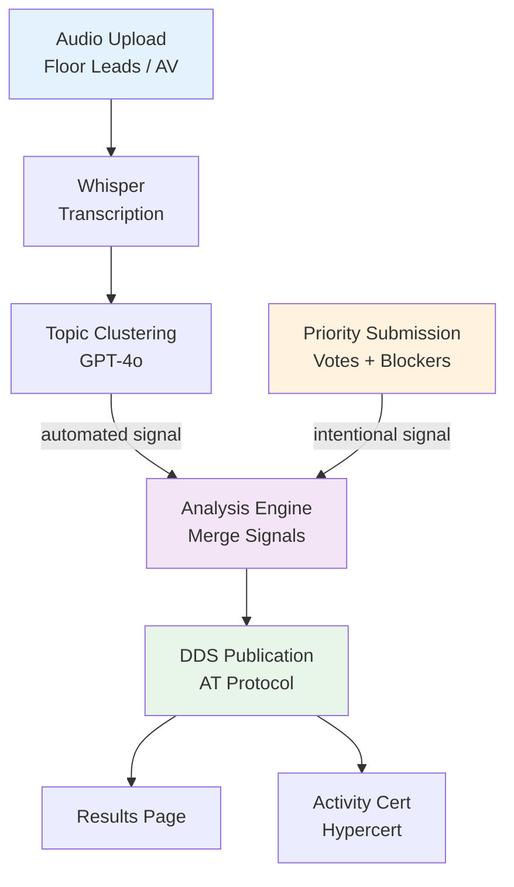
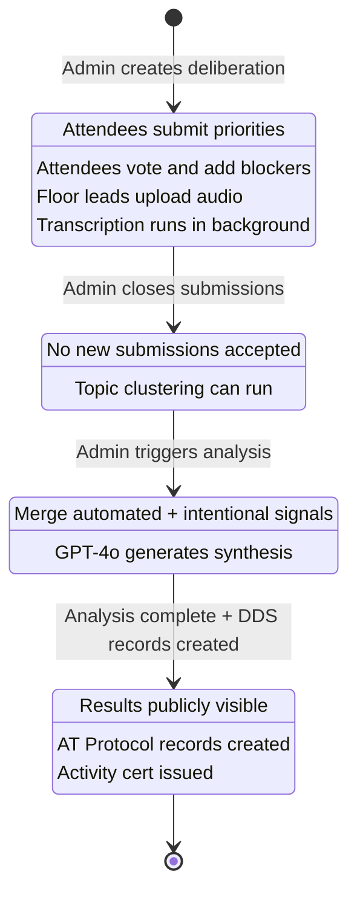
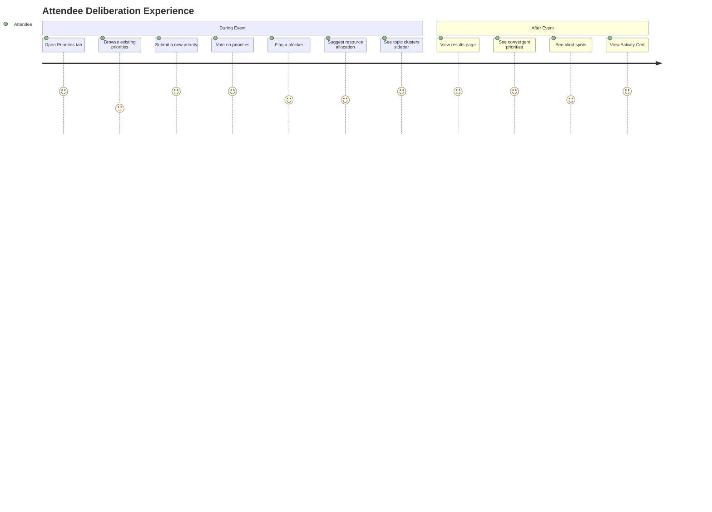
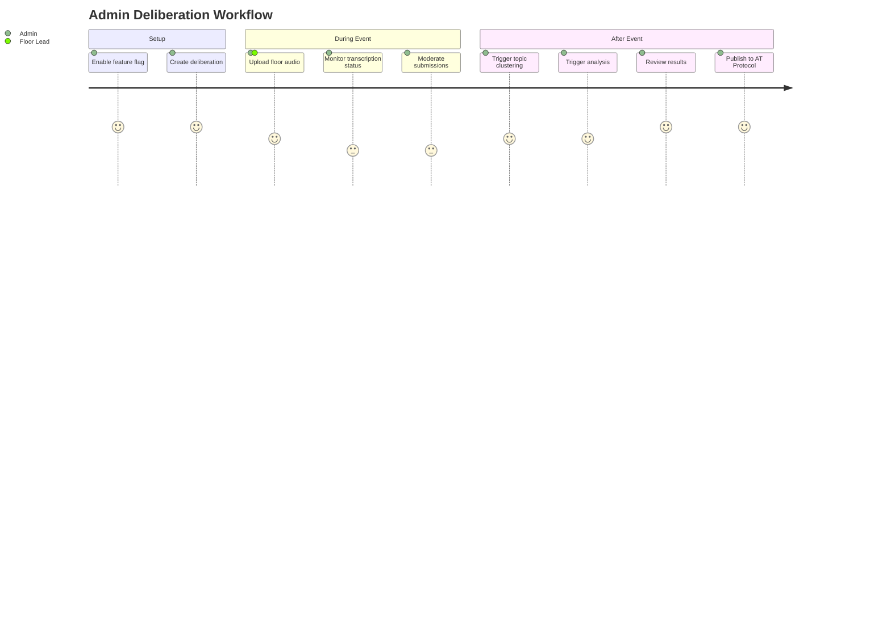

> **Note**: Architecture has changed to multi-repo. See GitHub issue #26 for current issue breakdown.
> **Live Transcription**: See GitHub issue #41 for the Frontier Tower SF deployment plan.
> Local specs retained for offline reference but GitHub issues are the source of truth.

# Conference Intelligence System

## Problem

Every FtC event surfaces hundreds of ideas, projects, and priorities across tracks. There is no structured way to capture what the community collectively believes matters most, what is blocking progress, or where resources should go. These insights live in hallway conversations and are lost after the event ends.

## Proposal

Build a collective intelligence feature powered by the Decentralized Deliberation Standard (DDS) that answers three questions:

1. **What matters most?**
2. **What are the blockers?**
3. **Where should resources go?**

Two collection channels feed into one analysis:

### Automated (transcription)

All floors are recorded and transcribed via Whisper. GPT-4o extracts topic clusters from transcripts, capturing what people are actually discussing across every track simultaneously.

> **Implementation (Frontier Tower SF)**: Tiered approach — Tier 1 rooms use Meetily (local Whisper `medium.en` on Apple Silicon Macs) with live sync to exponential database. Tier 2 rooms use iPhone Voice Memos → FFmpeg → OpenAI Whisper API batch transcription. See #41 and `scripts/meetily-sync.ts`, `scripts/batch-transcribe.ts`.

### Intentional (deliberation)

A "Priorities" tab where attendees submit priorities, flag blockers, vote, and suggest resource allocation. Captures what people think matters most.

### Merged analysis

The analysis engine merges both signals:

| Signal | Meaning |
|--------|---------|
| **Discussed + voted** | Clear community priority (convergent) |
| **Discussed but not submitted** | Blind spot |
| **Submitted but not discussed** | Aspirational priority |

Results are published as verifiable, decentralized DDS records on AT Protocol and certified with a Hypercert Activity Cert.

---

## The Experience

### During the event

1. Tier 1 rooms: Macs run Meetily with local Whisper, sync transcripts to exponential every 30s
   Tier 2 rooms: Floor leads record on iPhone, batch transcribe post-session via FFmpeg + Whisper API
2. GPT-4o extracts topics from transcripts in near-real-time (Tier 1) or post-session (Tier 2)
3. Attendees submit priorities, flag blockers, vote on what matters
4. Topic clusters sidebar shows what is being discussed across floors
5. Everything updates live

### After the event

1. Merge automated + intentional signals
2. LLM-powered synthesis answering the three core questions
3. Publish DDS records (`org.dds.result.summary`, `org.dds.result.pca`) on AT Protocol
4. Create Hypercert Activity Cert with all participants as contributors
5. Browsable on Hyperscan

---

## System Architecture

### High-Level Pipeline



### Data Flow

```
┌─────────────────────────────────────────────────────────────────┐
│                     DURING THE EVENT                             │
│                                                                  │
│  AUTOMATED CHANNEL              INTENTIONAL CHANNEL              │
│  ─────────────────              ───────────────────              │
│                                                                  │
│  Floor 1 Audio ─┐              Attendee A ─┐                    │
│  Floor 2 Audio ─┤─→ Whisper    Attendee B ─┤─→ Submit Priority  │
│  Floor 3 Audio ─┘   │         Attendee C ─┘   │                │
│                      ▼                          ▼                │
│              Transcripts              Priorities + Votes         │
│                      │                          │                │
│                      ▼                          │                │
│              Topic Clusters                     │                │
│              (GPT-4o)                           │                │
│                      │                          │                │
│                      └─────────┬────────────────┘                │
│                                ▼                                 │
│                       ┌────────────────┐                         │
│                       │ TOPIC SIDEBAR  │  ← Live during event    │
│                       └────────────────┘                         │
│                                                                  │
├──────────────────────────────────────────────────────────────────┤
│                     AFTER THE EVENT                               │
│                                                                  │
│              Topic Clusters ──┐                                  │
│                               ├──→ Analysis Engine               │
│              Voted Priorities ─┘        │                        │
│                                         ▼                        │
│                              ┌──────────────────┐                │
│                              │ SIGNAL MERGE      │                │
│                              │                   │                │
│                              │ Convergent:       │                │
│                              │  discussed+voted  │                │
│                              │                   │                │
│                              │ Blind Spot:       │                │
│                              │  discussed only   │                │
│                              │                   │                │
│                              │ Aspirational:     │                │
│                              │  voted only       │                │
│                              └────────┬─────────┘                │
│                                       ▼                          │
│                              ┌──────────────────┐                │
│                              │ DDS PUBLICATION   │                │
│                              │ ───────────────── │                │
│                              │ org.dds.result.   │                │
│                              │   summary         │                │
│                              │ org.dds.result.   │                │
│                              │   pca             │                │
│                              │ org.hypercerts.   │                │
│                              │   claim.activity  │                │
│                              └──────────────────┘                │
└──────────────────────────────────────────────────────────────────┘
```

### Status Lifecycle



---

## Deliverable

A published, verifiable, community-generated document:

- **Ranked priorities** -- what the community identified as most important (weighted by discussion + votes)
- **Key blockers** -- obstacles grouped by theme
- **Resource recommendations** -- where funding, talent, and tooling should go

Published on AT Protocol. Certified with a Hypercert listing every participant as a contributor.

---

## DDS Lexicon Records

### `org.dds.result.summary`

The merged analysis output containing ranked priorities, blocker themes, and resource recommendations.

Fields:
- `deliberationTitle` -- Name of the deliberation
- `eventName` -- Associated event
- `inputHash` -- SHA-256 hash of input data for verification
- `algorithm` -- Analysis algorithm identifier
- `rankedPriorities` -- Array of priorities with vote counts, signal strength, and classification
- `blockerThemes` -- Grouped blockers by theme
- `resourceRecommendations` -- Resource allocation suggestions
- `synthesis` -- LLM-generated narrative summary

### `org.dds.result.pca`

Topic clusters extracted from transcripts.

Fields:
- `deliberationTitle` -- Name of the deliberation
- `inputHash` -- SHA-256 hash of concatenated transcripts
- `algorithm` -- Extraction algorithm identifier
- `clusters` -- Array of topic clusters with labels, keywords, mention counts, and source excerpts

### `org.hypercerts.claim.activity`

Activity cert listing all participants (voters, priority submitters, transcript uploaders) as contributors.

### `org.hyperboards.board`

Board pointing to the activity cert for public display.

---

## Sub-Issues

| Issue | Scope |
|-------|-------|
| #27 Schema + transcription pipeline | Database models, audio upload API, Whisper transcription service |
| #28 Intentional collection | Deliberation tRPC router, priorities, voting, blockers |
| #29 Topic clustering from transcripts | GPT-4o structured topic extraction |
| #30 Analysis engine + DDS publication | Merge signals, classify priorities, publish AT Protocol records |
| #31 Participant UI + results page | Priority cards, voting, topic sidebar, results display |

---

## User Roles

| Role | Capabilities |
|------|-------------|
| **Attendee** (accepted applicant) | Submit priorities, vote, add blockers, suggest resources, view results |
| **Floor Lead** | All attendee capabilities + upload audio for their floor |
| **Admin / Staff** | All capabilities + create deliberation, trigger analysis, moderate, publish results |

---

## Status Lifecycle

```
COLLECTING  -->  CLOSED  -->  ANALYZING  -->  PUBLISHED
   (active)     (no new       (LLM          (results
                submissions)   processing)    public)
```

---

## User Journeys

### Attendee Journey



### Admin Journey



### Signal Classification

```
                    ┌───────────────────────────────────┐
                    │     IN TRANSCRIPTS?                │
                    │     (discussed on floors)          │
                    ├──────────┬────────────────────────┤
                    │   YES    │         NO              │
┌───────────┬──────┼──────────┼────────────────────────┤
│           │ YES  │          │                         │
│ VOTED BY  │      │ CONVERGENT                         │
│ ATTENDEES?│      │ Clear community                    │
│           │      │ priority                ASPIRATIONAL│
│ (submitted│      │                         Voted but   │
│  + voted) │      │                         not         │
│           │      │                         discussed   │
│           ├──────┼──────────┼────────────────────────┤
│           │ NO   │          │                         │
│           │      │ BLIND SPOT              (neither)  │
│           │      │ Discussed but                      │
│           │      │ not submitted                      │
└───────────┴──────┴──────────┴────────────────────────┘
```

---

## Technical Stack

- **Transcription**: OpenAI Whisper API
- **Analysis**: GPT-4o structured output
- **Storage**: PostgreSQL (Prisma ORM) + Vercel Blob (audio files)
- **Publication**: AT Protocol via `@atproto/api`
- **Certification**: Hypercert Activity Certs
- **Frontend**: Next.js + Mantine + tRPC
